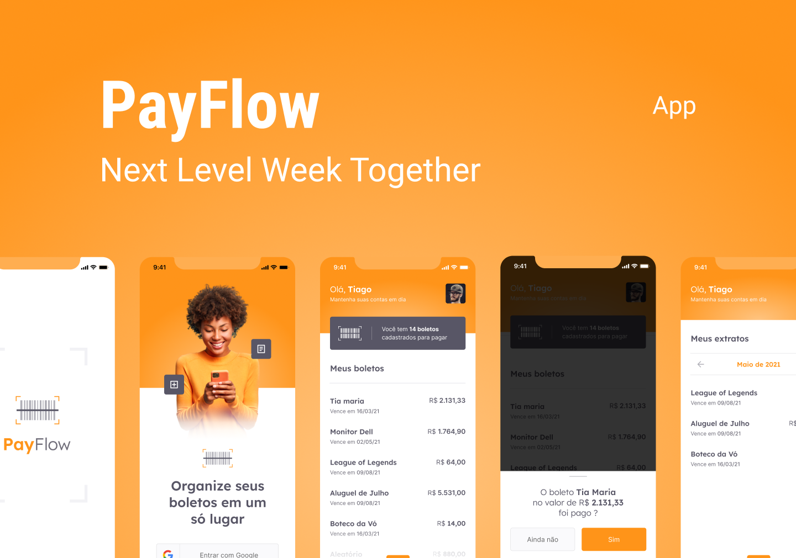

# nlw6_payflow

[Portuguese version]("./../README.md")



<center style="font-size: 18px">This project was created during *Next Level Week 6 - Together Edition*.

<center style="font-size: 18px">The idea behind this project is to create an app to manage bank statements.


### Stack e libs

[Flutter](https://flutter.dev/)

[Firebase](https://firebase.google.com/?hl=pt)

[google-fonts](https://pub.dev/packages/google_fonts)

[google-sign-in](https://pub.dev/packages/google_sign_in)

[animated-card](https://pub.dev/packages/animated_card)

[font-awesome](https://pub.dev/packages/font_awesome)


### Running this project

First clone this repository in some directory at your machine.

Then navigate to projects directory and run this command to install the dependencies: 

```text
flutter pub get
```

And then you can run the following command to start the application:

```
flutter run
```

Obs: If you are using VSCode with flutter extension, when you open the project it will ask to download the dependencies automatically, after downloading the dependencies you can use the debug tab in VSCode to run the project.
