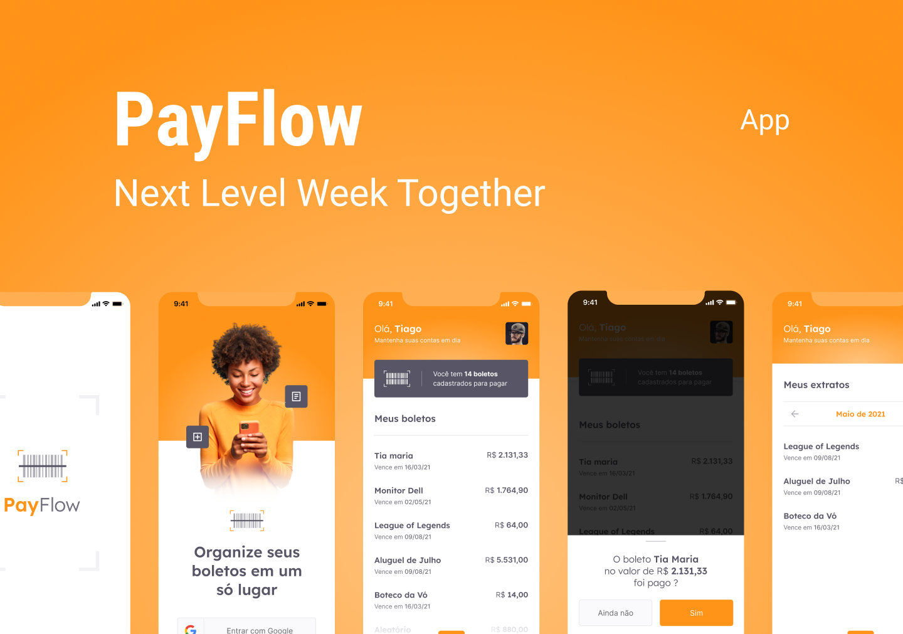

# nlw6_payflow

[English version]("./../README-en.md")



<center style="font-size: 18px">Esse projeto foi criado durante a *Next Level Week 6 - Edição Together*.

<center style="font-size: 18px">A ideia por trás do projeto é um aplicativo para o gerenciamento de boletos.


### Stack e bibliotecas

[Flutter](https://flutter.dev/)

[Firebase](https://firebase.google.com/?hl=pt)

[google-fonts](https://pub.dev/packages/google_fonts)

[google-sign-in](https://pub.dev/packages/google_sign_in)

[animated-card](https://pub.dev/packages/animated_card)

[font-awesome](https://pub.dev/packages/font_awesome)


### Rodando o projeto

Primeiro clone o repositório em algum diretório da sua máquina.

Depois navegue até a pasta do projeto e rode o comando para instalar as depedências: 

```text
flutter pub get
```

E por fim para executar:

```
flutter run
```

Obs: Se estiver usando o VSCode com a extensão do flutter, assim que abrir o projeto ele irá abrir uma janela perguntando se deseja baixar as depenências, após baixadas você também pode utilizar a aba de debug para rodar o projeto.
